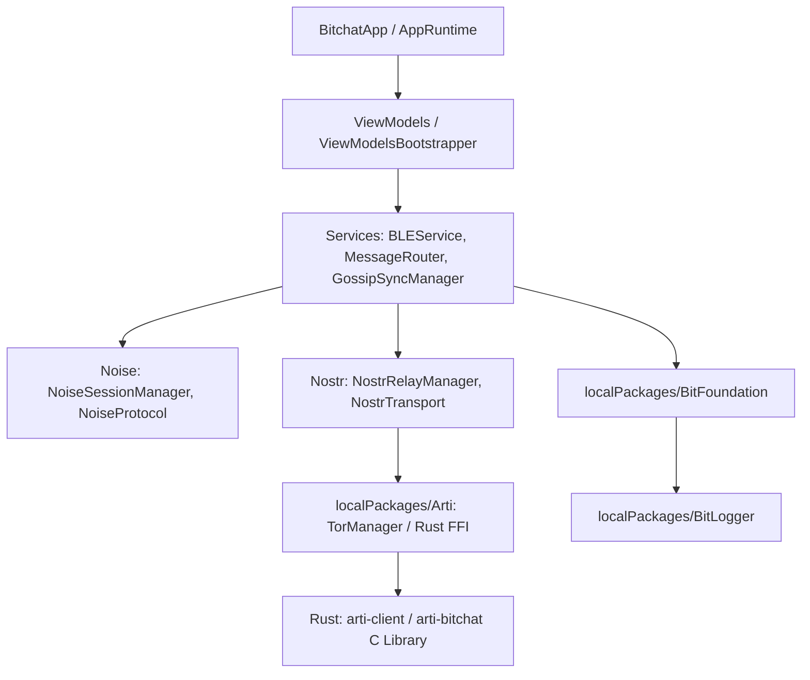
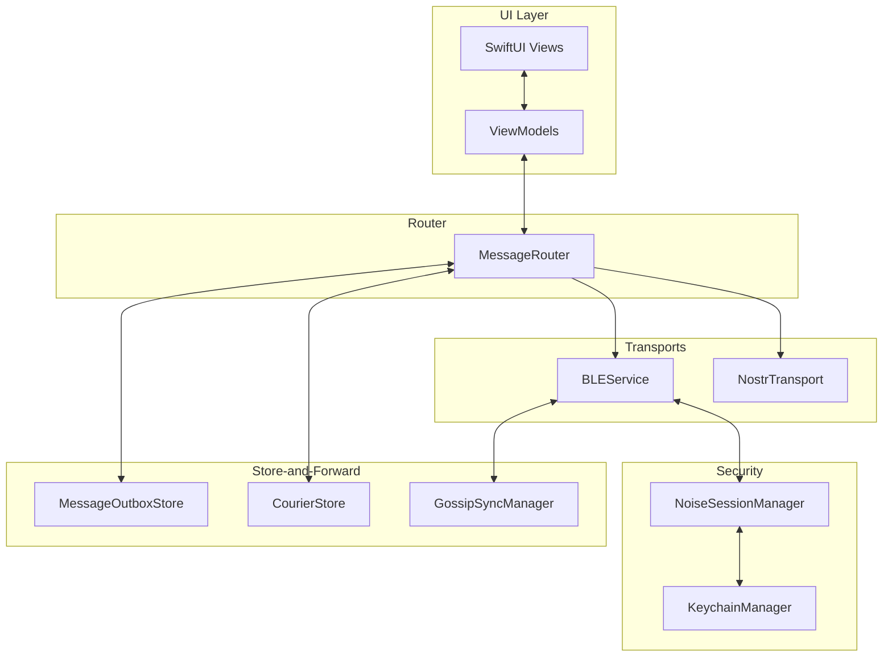
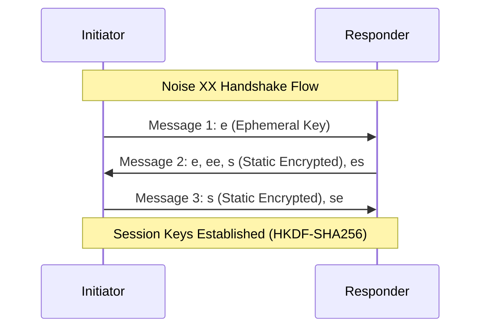
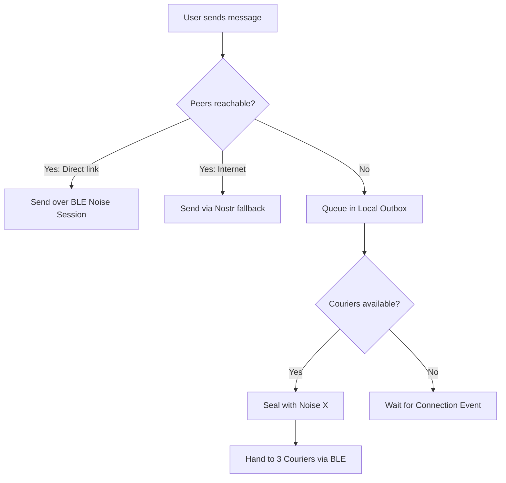

# EchoMesh: Architecture Discovery & Android Migration Blueprint

This document serves as the comprehensive technical blueprint for porting the decentralized, peer-to-peer messaging features of the **BitChat** iOS/macOS application to a native Android codebase (**EchoMesh**).

---

## 1. Repository Overview

The BitChat repository is a dual-platform (iOS and macOS) native codebase structured around native Swift APIs, the CoreBluetooth framework, and a custom Rust FFI core (`arti-bitchat`) for Tor networking. 

### Folder Structure
* `bitchat/`: The primary app package.
  * `App/`: App initialization (`BitchatApp.swift`, `AppRuntime.swift`).
  * `Features/`: Messaging, Board, Location Channel views, models, and controllers.
  * `Identity/`: Keychain managers and peer cryptographic identities.
  * `Models/`: Standard local and network data objects.
  * `Noise/`: Complete custom Noise Protocol XX/X handshake and encryption layer.
  * `Nostr/`: Nostr event definitions, Pow (Proof-of-Work), relay managers, and cryptographic envelopes.
  * `Protocols/`: Shared interfaces and custom binary encoding schemas.
  * `Services/`: Core platform services (BLE mesh engine, MessageRouter, GossipSync).
  * `Sync/`: Golomb-Coded Sets (GCS) and Gossip Sync managers.
  * `Views/`: SwiftUI components.
  * `ViewModels/`: MVVM state managers binding the SwiftUI views to background services.
* `localPackages/`: Custom dependencies managed by Swift Package Manager.
  * `Arti/`: Rust FFI integration wrapping the `arti-client` crate. Includes the `TorManager` control class and the `arti-bitchat` Rust library compiled for Darwin architectures.
  * `BitFoundation/`: Fundamental binary encoders, packet definitions, compression utilities, and constants.
  * `BitLogger/`: Shared logging utility.
* `docs/`: Extensive Markdown specifications for protocols (source routing, media migration, GCS sync, etc.).
* `relays/`: Configuration files and validation scripts for geo-positioned Nostr relays.
* `scripts/`: Helper scripts for build verification, CI pipelines, and performance checking.

### Module Dependency Graph



---

## 2. Application Lifecycle & Startup Flow

The application executes a structured sequence to transition from an uninitialized state to a ready, mesh-active state:

```
[ BitchatApp.init() ]
         ↓
[ Instantiate AppRuntime ] (Setup stores: Conversations, Identities, Locations)
         ↓
[ contentView.onAppear { AppRuntime.start() } ]
         ↓
[ NetworkActivationService & GeohashPresenceService starts ]
         ↓
[ ScenePhase transitions to .active ]
         ↓
[ TorManager.startIfNeeded() ] ──(Async Rust Boot)──> [ SOCKS5 Proxy Listening (Port 39050) ]
         ↓
[ NostrRelayManager.resetAllConnections() ] (WebSocket channels open via Tor SOCKS5)
         ↓
[ BLEService.startServices() ] (Central Manager & Peripheral Manager power on)
         ↓
[ SecureIdentityStateManager loads keys ] (Curve25519 static DH key & Ed25519 signing key)
         ↓
[ Device starts BLE Scanning & Advertising ] (Service UUID F47B5E2D-4A9E... Mainnet)
         ↓
[ GossipSyncManager starts periodic sync ] (Interval: 15s for messages, 30s for fragments)
         ↓
[ App in READY state ]
```

---

## 3. Subsystem Architecture

The core of the application relies on coordinate services bound via delegates and shared data stores:



### Subsystem Intercommunication
1. **`MessageRouter`:** Coordinates high-level send requests. If a target is flagged as reachable via `BLEService`, it initiates direct send. Otherwise, it executes `NostrTransport` fallback or places the message in `OutboxStore` / `CourierStore`.
2. **`BLEService`:** Handles CoreBluetooth GATT commands. Feeds parsed byte buffers into the `BLEInboundWriteBuffer` which combines fragments.
3. **`GossipSyncManager`:** Queries the message archives and GCS filters to reconcile state with adjacent nodes.
4. **`TorManager` & `NostrRelayManager`:** Creates SOCKS5 socket connections to allow anonymous WebSocket connections to relays.

---

## 4. Bluetooth Mesh Protocol Analysis

The Bluetooth Mesh layer is an ad-hoc, multi-hop, peer-to-peer network operating over raw GATT connection links. It is a **connected mesh** rather than an advertising-only (flooding) mesh, meaning nodes form active GATT central-peripheral connections to exchange data.

### BLE Advertising & Scanning
* **Service UUID:** `F47B5E2D-4A9E-4C5A-9B3F-8E1D2C3A4B5C` (Mainnet) or `F47B5E2D-4A9E-4C5A-9B3F-8E1D2C3A4B5A` (Testnet).
* **Characteristic UUID:** `A1B2C3D4-E5F6-4A5B-8C9D-0E1F2A3B4C5D` (Properties: `Write`, `Notify`).
* **Advertising Payload:** Contains **only** the Service UUID. The Local Name is omitted to prevent passive tracking and identity leakage in public areas.
* **Scan/Ad Duty Cycle:** RSSI-gated scan scheduler cycles scan and advertisement states to minimize battery drain.

### Binary Wire Format (BitchatPacket)
Packets are encoded using a compact, big-endian binary schema to fit within BLE MTU constraints:

```
Version 1 Header (14 bytes):
+--------+------+-----+-------------------+-------+---------------+
|Version | Type | TTL | Timestamp (Epoch) | Flags | PayloadLength |
|1 byte  |1 byte|1byte| 8 bytes (UInt64)  | 1 byte| 2 bytes       |
+--------+------+-----+-------------------+-------+---------------+

Version 2 Header (16 bytes):
+--------+------+-----+-------------------+-------+---------------+
|Version | Type | TTL | Timestamp (Epoch) | Flags | PayloadLength |
|1 byte  |1 byte|1byte| 8 bytes (UInt64)  | 1 byte| 4 bytes       |
+--------+------+-----+-------------------+-------+---------------+

Variable Fields (Depends on flags):
+----------------+--------------------+------------------+-------------------+
| SenderID       | RecipientID        | Payload          | Signature         |
| 8 bytes        | 8 bytes (Optional) | Variable         | 64 bytes(Optional)|
+----------------+--------------------+------------------+-------------------+
```

#### Flags byte mapping:
* `0x01`: `hasRecipient`
* `0x02`: `hasSignature`
* `0x04`: `isCompressed` (Uses zlib compression if payload size > 100 bytes and entropy is low)
* `0x08`: `hasRoute` (Source-routed path present)
* `0x10`: `isRSR` (Request Source Route flag)

### Packet Fragmentation & Reassembly
Packets exceeding the negotiated BLE MTU size are split into fragments:
* **Fragment Format:** 8-byte Fragment ID (hash), 2-byte fragment index, 2-byte total count, and chunk payload (max ~469 bytes).
* **Reassembly Buffer:** Managed by `BLEFragmentAssemblyBuffer`. Collects out-of-order fragments. Reassembly ceilings are enforced (256 fragments for legacy compatibility, up to 10,000 for optimized versions). 30-second assembly timeout, 1 MiB cap per transfer.

### Routing & Flood Control
* **TTL (Time to Live):** Packets originate with `TTL = 7`. Reliably decremented by 1 at each hop. If `TTL <= 1`, the packet is dropped.
* **Deduplication:** seen-set LRU cache (1,000 entries, 5-minute expiry) drops duplicate packets using a hash of the sender, timestamp, type, and payload.
* **Controlled Flood (Relay Jitter):** Nodes delay relaying to allow duplicates to arrive from other links and trigger duplicate suppression. The delay is randomized based on graph density (connection degree):
  * **0-2 links:** 10–40 ms (Minimize latency on thin chains)
  * **3-5 links:** 60–150 ms
  * **6-9 links:** 80–180 ms
  * **>=10 links:** 100–220 ms (Wide window allows dense nodes to drop duplicates)
* **Source Routing:** Verified paths are exchanged via announcements. If a route exists, packets are directed sequentially along it. If a link fails, it falls back to standard mesh flooding.

---

## 5. Message Lifecycle Sequence

The following sequence illustrates the flow of a private text message from the initiator's keyboard to the recipient's display:

```
[ Initiator: Types Message & Presses Send ]
                     ↓
[ VMs: ChatViewModel.sendPrivateMessage() ]
                     ↓
[ Router: MessageRouter selects transport ] ──(If direct link exists)──> [ BLE Transport ]
                     ↓
[ Crypto: NoiseSessionManager.encrypt() ] (ChaCha20-Poly1305 payload encryption)
                     ↓
[ Foundation: BitchatPacket wraps ciphertext ] (Set type = noiseEncrypted, TTL = 7)
                     ↓
[ BLE: Fragmenter splits packet into MTU chunks ] (Index/Total header prepended)
                     ↓
[ Hardware: CoreBluetooth Central writes characteristic ]
                     ↓
[ Relay Node: Receives fragments & reassembles packet ]
                     ↓
[ Relay Node: Deduplication check ] ──(If already seen)──> [ Drop Packet ]
                     ↓
[ Relay Node: Decrement TTL, compute random jitter delay ]
                     ↓
[ Relay Node: Broadcasts packet to peers ]
                     ↓
[ Recipient: CoreBluetooth Peripheral receives notify ]
                     ↓
[ Recipient: BLEFragmentAssemblyBuffer reassembles packet ]
                     ↓
[ Recipient: Decrypts packet via Noise session key ]
                     ↓
[ UI: ChatViewModel receives message event and renders in SwiftUI Views ]
```

---

## 6. Cryptography & Security Architecture

BitChat enforces strict E2E encryption and metadata protection policies across all networks.



### Identity and Keys
* **Noise Static Key:** Curve25519 static key pair. Stable identity. The first 8 bytes of the SHA-256 fingerprint of the public key acts as the 8-byte **Peer ID**.
* **Signing Key:** Ed25519 key pair used for packet authentication.
* **Storage:** Both keys are saved in the iOS Keychain (using `KeychainManager.swift`).

### Session Key Agreements
1. **Live Mesh sessions (Noise XX):** Initiated via `initiateNoiseHandshake()`. Both parties exchange Curve25519 ephemeral keys, perform ECDH, exchange signed static public keys under encryption, and derive separate symmetric keys for encryption and decryption using HKDF-SHA256.
2. **Offline Seals (Noise X):** When sending mail via couriers without a session, the payload is sealed using a one-way Noise X pattern against the recipient's static public key. Authenticated but lacks forward secrecy.

### Packet Verification & Replay Protection
* **Sliding Window:** `NoiseCipherState` keeps a sliding bitmask window of 1,024 received nonces. Out-of-order packets are validated; duplicates are immediately rejected.
* **Signature Scope:** Ed25519 signatures sign the entire packet payload *excluding* the TTL byte to allow routers to decrement it without invalidating the cryptographic signature.

---

## 7. Store-and-Forward Mechanisms

To guarantee eventual delivery across disconnected graphs or offline intervals, three systems cooperate:



### Store-and-Forward Subsystems
1. **Sender Outbox:** Messages are encrypted locally on disk under a temporary keychain key. They are re-sent on reconnection up to 8 times before failing.
2. **Mesh Couriers (Spray & Wait):**
   * **HMAC Recipient Tags:** Addresses are masked. Couriers carry envelopes with only a 16-byte tag: `HMAC-SHA256(recipientStaticKey, "bitchat-courier-tag-v1" || epochDay)`.
   * **Copy Budget:** Envelopes carry a budget byte (max 8). When courier A meets courier B, it splits the copy budget (e.g. A retains 2, B gets 2) to disperse the message through a moving crowd without network saturation.
   * **Handover:** Upon hearing a verified announcement from the recipient, the courier flushes the envelope directly to them.
3. **Gossip Synchronization (Public History):**
   * Devices compile Golomb-Coded Sets (GCS) containing hashes of public messages cached over the last 6 hours.
   * Reconciling devices exchange these filters, calculate the symmetric difference, and request missing messages.

---

## 8. Data Model Inventory

| Model Name | Purpose | Critical Fields | Relationships | Lifecycle |
|:---|:---|:---|:---|:---|
| **`PeerID`** | stable 8-byte routing identifier | `id: String` (hex), `data: Data` | Maps to cryptographic keys and nickname | Persistent in keychain |
| **`BitchatPacket`** | Binary wire packet | `version`, `type`, `senderID`, `recipientID`, `payload`, `signature`, `ttl` | Contains payload (Message, Handshake, Sync) | Ephemeral (dropped after relay or seen-set expiry) |
| **`BitchatMessage`** | User-visible message | `id`, `sender`, `content`, `timestamp`, `isPrivate`, `deliveryStatus`, `isBridged` | Contained inside a conversation list | Decoded on the fly; lives in memory, erased on wipe |
| **`CourierEnvelope`** | Sealed envelope for offline carrying | `recipientTag` (16 bytes), `expiry`, `ciphertext`, `copies`, `prekeyID` | Opaque payload containing encrypted Message | Persisted in `CourierStore` up to 24h or until expiry |
| **`NostrEvent`** | Canonical JSON object for Nostr | `id`, `pubkey`, `created_at`, `kind`, `tags`, `content`, `sig` | Can contain nested envelopes (Kind 1059) | Ephemeral transmission object |
| **`GeohashChannel`** | Location-based chat room | `geohash: String`, `precision: Int`, `name: String` | Contains local Nostr relays and participant trackers | Generated dynamically from active GPS coordinate |

---

## 9. Third-Party Dependency Inventory

| Dependency | Purpose | Criticality | Android Replacement | Notes |
|:---|:---|:---|:---|:---|
| **`swift-secp256k1`** | ECDSA / Nostr key signatures | **Required** | `secp256k1` native JNI wrapper | Crucial for signing and verifying kind-1/13/1059 Nostr events |
| **`Arti` (Rust crate)** | Tor proxy client wrapper | **Required** | Rust `arti-client` via JNI | Local SOCKS5 proxy compilation for Android (arm64-v8a/x86_64) |
| **`CryptoKit`** | Native Apple cryptography | **Required** | `Android Keystore` + `BouncyCastle` / ` Tink` | Used for Curve25519, ChaCha20-Poly1305, SHA256 |
| **`Compression`** | Apple native zlib library | **Required** | `java.util.zip.Deflater` | Used to compress packet payloads |

---

## 10. Android Migration Map

| Apple / Swift Component | Android / Kotlin Destination | Implementation Notes |
|:---|:---|:---|
| **SwiftUI** | **Jetpack Compose** | Fully declarative, matches the state-driven UI patterns |
| **CoreBluetooth** | **Android BLE API** (`BluetoothGatt`) | Requires handling Central and Peripheral managers in a unified foreground service |
| **Keychain** | **Android Keystore System** | Symmetric keys stored in Keystore; asymmetric keys generated via Tink/BouncyCastle |
| **UserDefaults (AppGroup)** | **DataStore (Preferences)** | Jetpack DataStore handles key-value pairs asynchronously |
| **`BLEService.swift`** | **`BLEMeshManager.kt`** | Drives background BLE scanning/advertising, GATT callbacks, and write loops |
| **`MessageRouter.swift`** | **`MessageRouter.kt`** | Single dispatcher routing messages to BLE or NostrTransport |
| **`NoiseEncryptionService.swift`** | **`NoiseEncryptionManager.kt`** | Handles Noise XX/X flows using Kotlin-native or JNI-linked Noise primitives |
| **`GCSFilter.swift`** | **`GcsFilter.kt`** | Math port of Golomb-Rice coding and SHA-256 bitstream manipulation |
| **`TorManager.swift`** | **`TorProxyManager.kt`** | Manages JNI lifecycle of embedded Rust `arti-client` |

---

## 11. Recommended Android Architecture

For **EchoMesh**, we propose a **Clean Architecture** combined with **MVVM** and a highly robust background service structure to support local radio operations:

```
                  ┌──────────────────────────────┐
                  │          UI Layer            │
                  │   (Compose + ViewModels)     │
                  └──────────────┬───────────────┘
                                 │
                  ┌──────────────▼───────────────┐
                  │         Domain Layer         │
                  │   (Use Cases + Model Specs)  │
                  └──────────────┬───────────────┘
                                 │
  ┌──────────────────────────────┼──────────────────────────────┐
  │                              ▼                              │
┌─┴──────────────────────────────┐            ┌─────────────────┴─────────────┐
│          Data Layer            │            │         Service Layer         │
│  (DataStore + Room DB Cache)   │            │ (Unified BLE Service + Tor)   │
└────────────────────────────────┘            └───────────────────────────────┘
```

### Framework Choices & Rationale
1. **Kotlin Coroutines & Flow:** Replaces Apple's Combine framework. Flow is perfect for streaming BLE byte packets, connection states, and Nostr event queues.
2. **Jetpack Compose:** Declarative UI mapping perfectly to the swift UI architecture.
3. **Room Database:** Local storage cache for favorites and metrics.
4. **Hilt (Dependency Injection):** Manages singletons (`TorProxyManager`, `BLEMeshManager`, `MessageRouter`) and injects them into ViewModels.
5. **Kotlin Serialization:** Native JSON/CBOR processing for Nostr integration.
6. **WorkManager:** Background sweep tasks for Outbox/Courier retries.

---

## 12. Risk Assessment

* **1. Foreground Service Constraints (Android 14+)**
  * **Risk:** High
  * **Impact:** Bluetooth scanning/advertising is heavily restricted in the background. Android will kill services running background BLE scans without visible persistent notifications and appropriate foreground service type flags (`connectedDevice`).
  * **Mitigation:** Wrap `BLEMeshManager` in a robust Foreground Service using a sticky notification and acquire wakelocks when transmitting files.
* **2. CoreBluetooth vs Android BLE GATT API Stability**
  * **Risk:** High
  * **Impact:** Android BLE API is notoriously unstable. Simultaneous Central and Peripheral roles on older devices can cause GATT cache corruption or internal connection drops.
  * **Mitigation:** Implement strict write queue sequencing, connection timeouts, and programmatic GATT cache clears upon device disconnection.
* **3. Tor/Arti compilation for Android NDK**
  * **Risk:** Medium
  * **Impact:** Building `arti-client` via Rust `cargo` compiler for Android targets (arm64-v8a) requires setting up cross-compilation toolchains and loading the `.so` binary cleanly.
  * **Mitigation:** Set up a dedicated GitHub Actions runner using the `cargo-ndk` toolchain to package the binary.
* **4. Cryptographic Interoperability**
  * **Risk:** Medium
  * **Impact:** Deriving Noise XX shared keys on Android must produce identical results as CryptoKit on iOS.
  * **Mitigation:** Run standard Vector tests (included in `NoiseTestVectors.json`) against the Android cryptographic engine to confirm alignment.

---

## 13. Future Extension Points

To ensure Sprint 2 and future sprints can safely add features without modifying the core transport architecture, the following hooks are exposed:

1. **User Profiles:**
   * *Hook:* announcements packet payload can accept an optional custom metadata TLV containing profile details (avatar hashes, bio).
2. **QR Pairing:**
   * *Hook:* `VerificationService` can generate/read Base64 identity strings. A verification screen can read the QR code and pin the fingerprint.
3. **Media Sharing:**
   * *Hook:* `BLEFileTransferHandler` already has standard fragmentation protocols. Android can register an asset dispatcher on top of this buffer.
4. **Offline Friend Discovery:**
   * *Hook:* Mesh announcements register presence. A listener on the `peerRegistry` stream can trigger local system notifications when favorites are discovered in BLE range.
